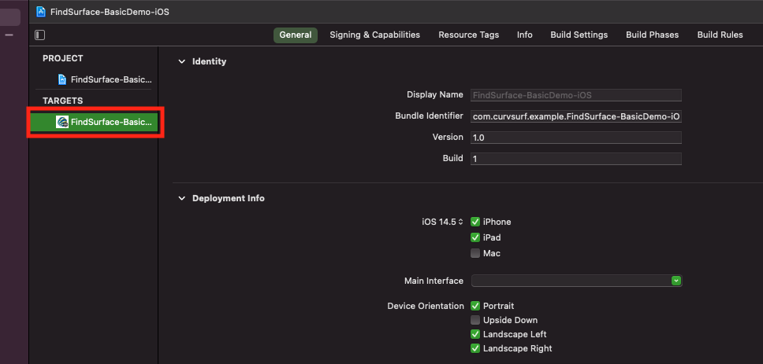
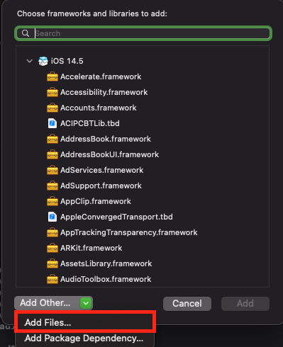
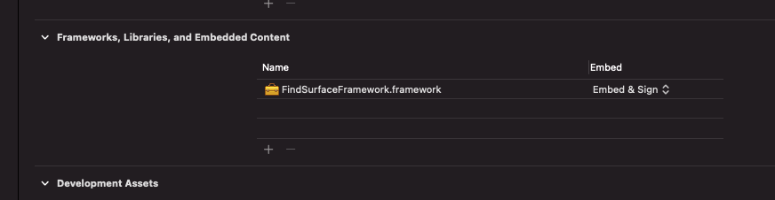
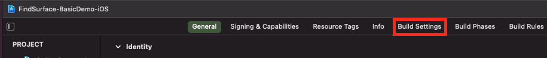
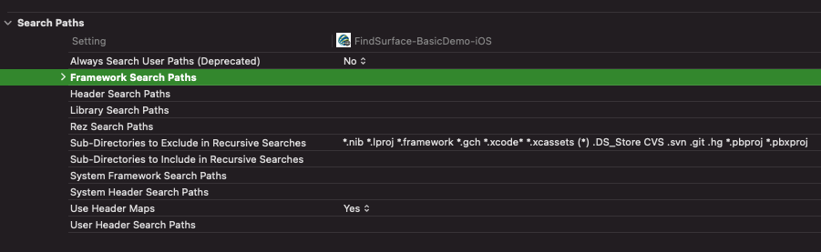
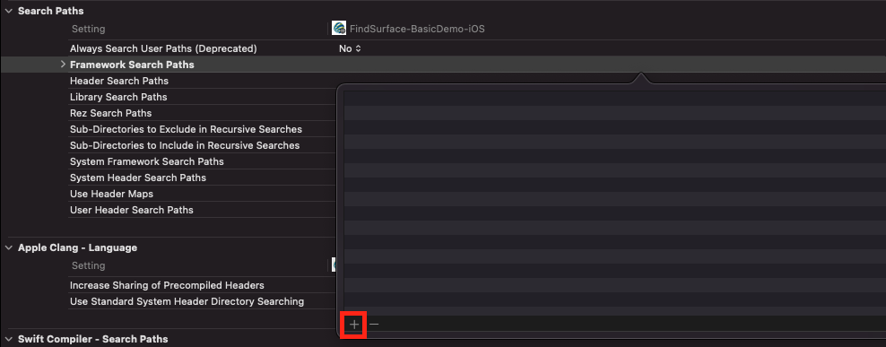
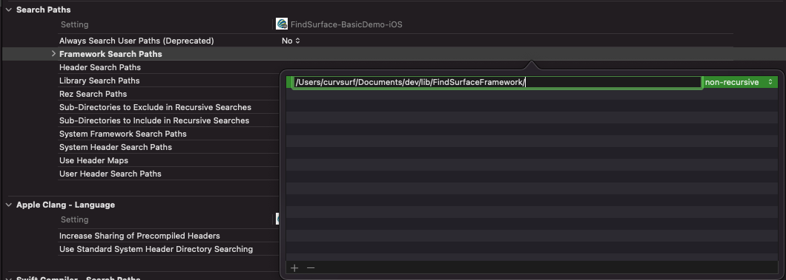
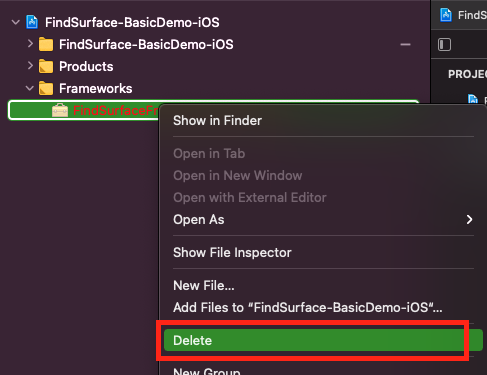

# How to import FindSurface Framework to your project

----

This document describes how to import FindSurface Framework to your project in xcode.

These instructions below are written as of the time that the latest version of Xcode is 12.5.1.

### Step 1. Download the framework

Download the distributed framework from [here]. Put the downloaded content to anywhere you want.

### Step 2. Add the framework to your project

Select your project name in the project navigator (left panel).

You will see the project property settings in the editor area. Make sure your project target to be selected below `TARGETS`.

In the `General` tab, locate `Frameworks, Libraries, and Embedded Content` group and click the `+` button.

When a dialog pops up, click `Add Other...` at the bottom of the dialog and select `Add Files`.

Locate and select the downloaded framework, and click `Open`.

Now then you will see the framework is shown in the  `Frameworks` subdirectory of your project in the project navigator, meaning it is successfully imported to your project.

### Step 3. Set framework search path

Select `Build Settings` in the project property settings.

Locate `Framework Search Paths` items in the `Search Paths` group.

Double tap the value field of `Framework Search Paths` to open the dialog for path list and click `+` button.

Write the downloaded path from step 1 in the field (excluding `FindSurfaceFramework.Framework`).

Press enter key and click other than the dialog to ensure the modification to be applied.

### Note

1. The framework in the `Frameworks` subdirectory turns red (invalidated) and the build fails if the framework is removed or replaced while Xcode is open. In that case, select the invalidated framework, open the context menu (by right-click or two-finger tap), remove the framework, and then retry the step 2.

   

2. When you relocate the framework, try the step 3 again as well as the step 2.

